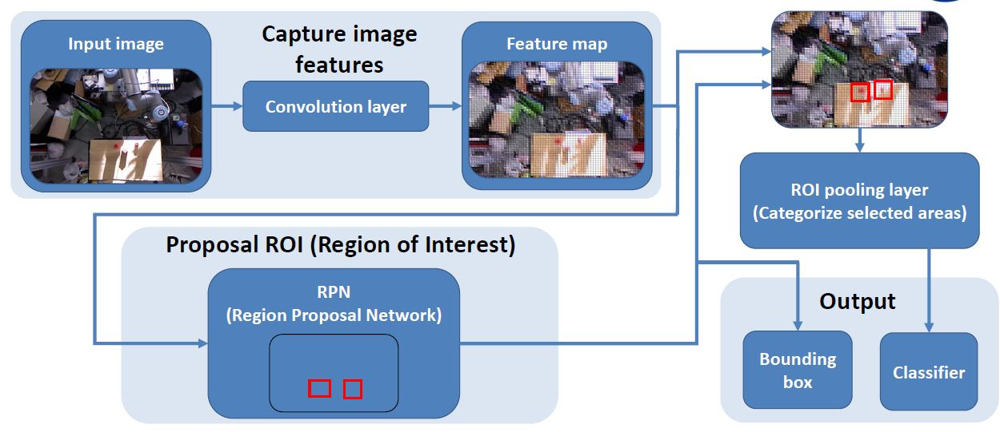
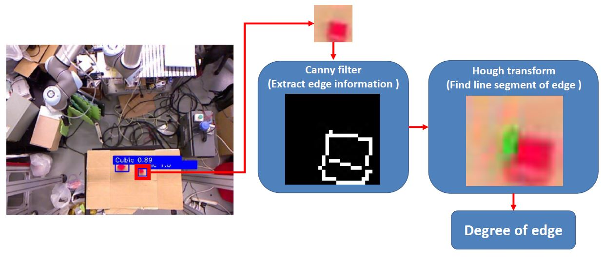
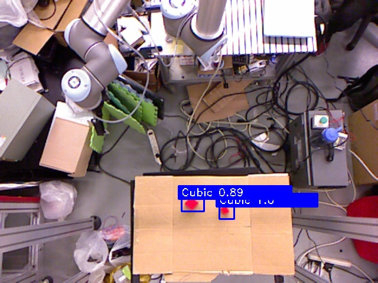
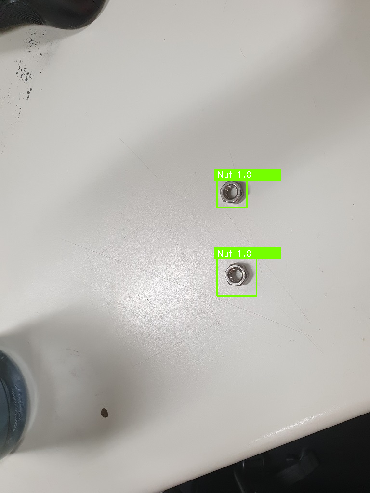
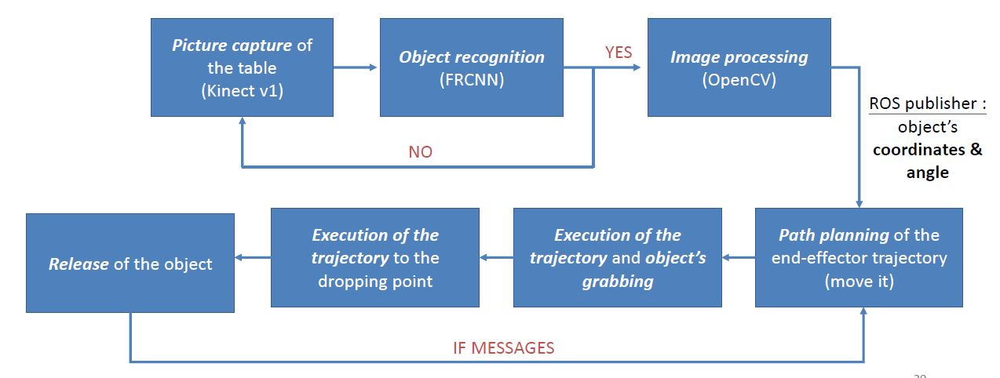
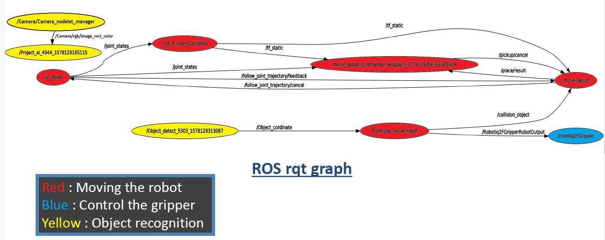

**Bin detection and picking project** 🤖🦾🚮🗑️
======
This repo is the final project for the Fall 2019 National Taiwan University (NTU) class EE 5190 AI Enhanced Robot Sensing and
Control System. It aims to develop an approach to automatically detect and sort bins using an UNIVERSAL
ROBOT arm (UR10). A kinect camera is used to get images of the object and an object recognition algorithm is used to classify and get their position in the space.
We then have access to the depth information as a powerful information.

## I) Key Modules used

|                                       *Computer vision*                                       |                                                                *Object detection and localisation*                                                                 |                       *Robot Application*                       |                                 *Robot Control*                                  |
|:---------------------------------------------------------------------------------------------:|:------------------------------------------------------------------------------------------------------------------------------------------------------------------:|:---------------------------------------------------------------:|:--------------------------------------------------------------------------------:|
|        |  |  |  |
|                        OpenCV package (Canny filter & Hough transform)                        |                                            tensorflow based *faster region-based convolutional neural network (FRCNN)*                                             |              ROS : Robot Operating System library               |                                 Move It library                                  | 
| Process the cropped images of every objects  to extract precisely the position and angle. |                                         Detect the objects learned during training and predict the corresponding position                                          |   Manage the different parts of the architecture in parallel    |                  Move the robot arm to pick up and lift objects                  | 

## II) Object detection :
 
 

|     |  | 
|:---------------------------:|:---------------------------------:| 
|      *Result on cubes*      |         *Result on Nuts*          |

## III) ROS Architecture :

The ROS library allow use to separate different tasks of our algorithm into independent nodes running in parrallel.
It automatically start the nodes and send messages between them to share information. Different node are created for the object detection, robot operation and camera control.  

 
 

## Authors :
GUILLAUME DESERMEAUX, HUANG CHUN-CHI, YI-TING PENG, WEN YEN-CHUN
